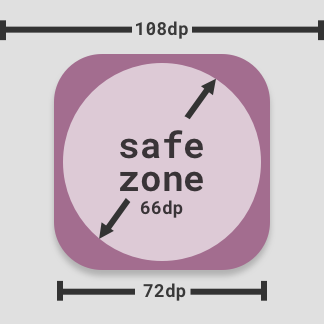

``icons``: App icons
====================

The ``icons`` configuration allows you to define the icons to be used for
your app.

All icons are square, and must be placed in your ``src``
directory. Paths to your icons should be specified relative to your `src` directory.

> ::Important:: All icons need to be supplied in PNG format.

## Config options

### Android

48, 72, 96, 144, 192
:	Paths to various icons used to represent your app (all required), relative to your `src` directory.
    The numbers represent the height/width of the icon in pixels.

#### Adaptive

background-color
:   The color for the adaptive icon's background - e.g. `#fe30a5`

108, 162, 216, 324, 432
:	Paths to various icons used to represent your app (all required), relative to your `src` directory.
    The numbers represent the height/width of the icon in pixels.

### iOS

57, 72, 76, 114, 120, 144, 152, 167, 180
:	Paths to various icons used to represent your app on an iOS device (all required), relative to your `src` directory.
    The numbers represent the height/width of the icon in pixels.

Prerendered
:	Setting this to true will stop iOS from applying the gloss effect to your icons.

> ::Note:: If you specify *any* icons for a particular platform, you **must**
specify all required icons!

## Notes on Android icons

From Android 8.0 (API Level 26) onwards the preferred format for Android icons are the so-called "adaptive" icon format.

Adaptive icons will be displayed as different shapes across different Android device models according to the "shape mask" used by the particular device model.

For instance, on one device model the launcher icons may be circular whereas a different device model may render launcher icons as rounded squares.

To accomodate the different shapes, icon sizes are now sized larger than the visible area with a "safe zone" in the center which is guaranteed to not be clipped by the shape mask.

In relative measurements, adaptive icons are 108dp x 108dp in size, with a "safe zone" of 66dp x 66dp in the center:

[In absolute measurements](https://pixplicity.com/dp-px-converter), for each icon size the corresponding safe zone is equal to:

| Pixel Density | Icon Size | Safe Zone Size |
| ------------- | --------- | --------------
| mdpi          | 108px     |  66px          |
| hdpi          | 162px     |  99px          |
| xdpi          | 216px     | 132px          |
| xxdpi         | 324px     | 198px          |
| xxxdpi        | 432px     | 264px          |

For more information please see the following:

* [Understanding Android Adaptive Icons](https://medium.com/google-design/understanding-android-adaptive-icons-cee8a9de93e2)
* [Designing Adaptive Icons](https://medium.com/google-design/designing-adaptive-icons-515af294c783)
* [Android UI Guidelines: Adaptive Icons](https://developer.android.com/guide/practices/ui_guidelines/icon_design_adaptive)
